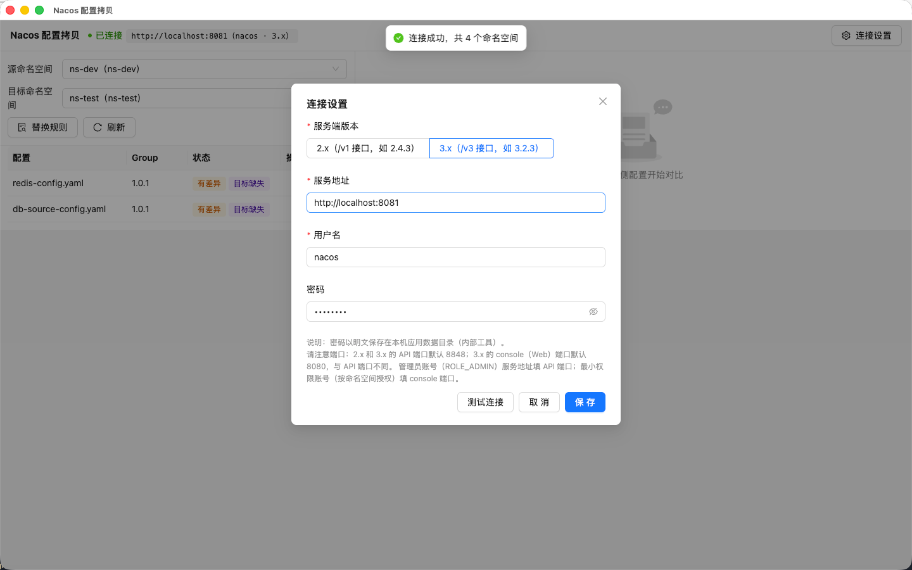
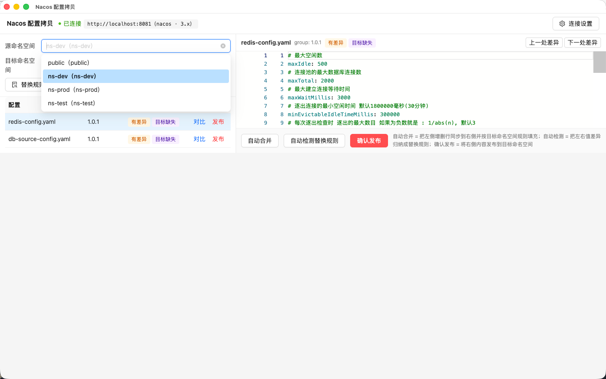
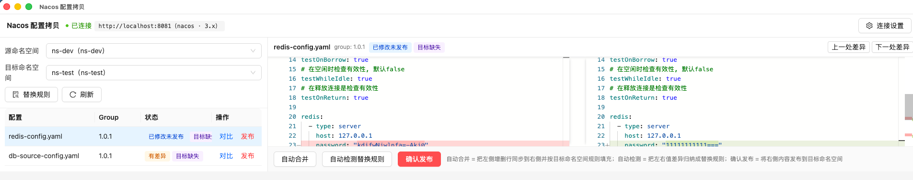
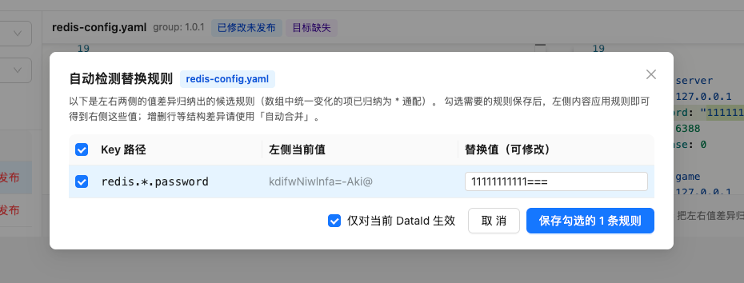
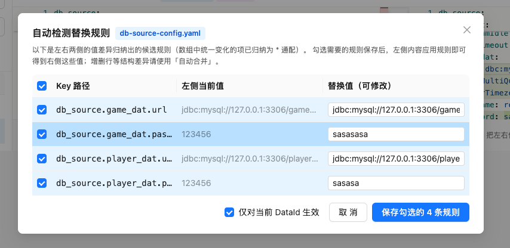
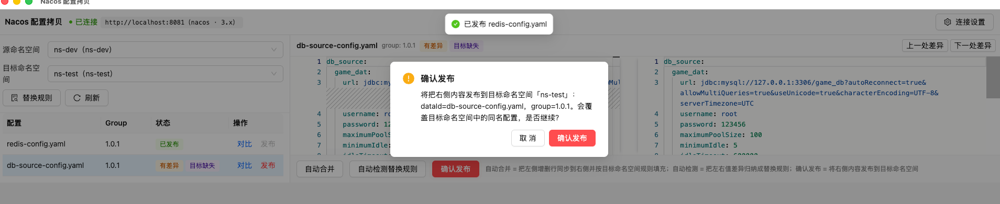
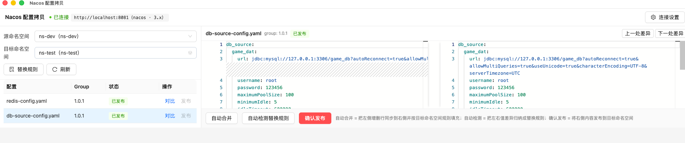

# Nacos 配置拷贝（nacos-config-copy）

跨平台 PC 客户端（macOS / Windows），用于把一个 Nacos 命名空间下的配置**批量拷贝**到另一个命名空间，
拷贝时按预设的 **key/value 规则**自动替换值，并提供**类 SVN merge 的双栏逐行对比**、自动合并与逐条确认发布。

典型场景：把 `dev`（开发环境）的配置同步到 `prod`（生产环境），
自动把 `login.baseUrl: http://127.0.0.1:3300` 替换为 `http://svc.internal:3300` 等差异值。

## 功能

- **连接设置**：服务地址 / 用户名 / 密码 / **服务端版本（2.x 或 3.x）**，界面可改，持久化保存（默认 `http://localhost:8848` / `nacos` / `nacos` / 2.x）
- **命名空间列表**：自动列出全部命名空间，任选源与目标
- **替换规则**（按目标命名空间维护）：如 `login.baseUrl → http://svc.internal:3300`
  - **DataId 限定**：每条规则可指定只对某个文件名生效，支持 `*` 通配符（如 `*-application.yaml`），留空对所有配置生效
  - yaml / json：按嵌套 key 路径定位改值，**注释与格式完整保留**（数组下标如 `hosts.0.url` 也支持）
  - `*` 通配段：`redis.*.host` = 替换数组中**每个元素**的 host（对象上 `*` = 全部值），与数组长度无关
  - 新值继承原节点类型：原值是数字/布尔时写入不加引号（如 `port: 6379`），否则按字符串
  - properties：按行替换 key 的值
  - 路径不存在 / 无法识别的格式：跳过并给出警告，不静默改坏配置
- **双栏对比**：左 = 源命名空间配置，右 = 目标命名空间配置（不存在时按规则填充预览），
  Monaco 编辑器逐行 diff，**左右均可编辑**，可跳转上一处/下一处差异
- **自动合并**：把左侧增加/删除的行同步到右侧，并按目标命名空间规则填充值
- **自动检测替换规则**：对比界面一键把左右两侧的值差异归纳成候选规则
  （数组中统一变化的项自动归纳为 `redis.*.host` 通配），勾选需要的保存进替换规则
- **确认发布**：每条配置逐一确认发布（覆盖目标同名配置），外层列表实时标记状态：
  无差异 / 有差异 / 目标缺失 / 已修改未发布 / 已发布 / 发布失败

## 使用示例

1. 连接设置：选择服务端版本（2.x / 3.x）、服务地址与账号，测试连接成功后即可使用。

   

2. 选择源 / 目标命名空间，配置列表实时标记差异状态（有差异 / 目标缺失等）。

   

3. 点击「对比」打开双栏逐行 diff，左右两侧均可编辑；编辑后状态变为「已修改未发布」。

   

4. 「自动检测替换规则」把左右值差异归纳成候选规则，数组中统一变化的项自动归纳为通配（如 `redis.*.password`）。

   

5. 一次检测出多条差异时可逐条勾选、修改替换值后保存进替换规则。

   

6. 「确认发布」逐条发布，确认框明确目标命名空间与 dataId / group，防止误覆盖。

   

7. 发布完成后列表状态变为「已发布」，发布按钮自动禁用。

   

## 开发

```bash
npm install
npm run dev        # 启动开发版（带热更新）
npm test           # 规则引擎单元测试
npm run typecheck  # TypeScript 检查
```

无界面冒烟测试（需本地 Nacos 运行，会创建并删除临时命名空间 `cc-scratch`）：

```bash
npx tsx scripts/e2e-smoke.mts
```

## 打包

```bash
npm run build:mac   # 产出 release/*.dmg（arm64 + x64）
npm run build:win   # 产出 Windows NSIS 安装包（在 Windows 上执行）
```

注意事项：

- **macOS**：应用未签名，首次打开请「右键 → 打开」，或执行 `xattr -cr /Applications/NacosConfigCopy.app`
- **Windows**：SmartScreen 提示「已保护你的电脑」时选择「仍要运行」
- **密码存储**：连接密码以明文保存在本机应用数据目录（内部工具场景可接受）

## 技术栈

Electron + React 19 + TypeScript + Ant Design 6 + Monaco DiffEditor + zustand + electron-vite / electron-builder。

Nacos HTTP 请求全部走 Electron 主进程（Nacos 无 CORS 头）。两个版本线路均已实测：

- **2.x**（本地 2.4.3 实测）：登录 `/nacos/v1/auth/login`；命名空间 `/nacos/v1/console/namespaces`；配置列表/发布 `/nacos/v1/cs/configs`（自动翻页，列表直接返回内容）
- **3.x**（docker 3.2.3 实测）：登录仍为 `/nacos/v1/auth/login`；命名空间/配置/发布走 `/nacos/v3/...`
  （自动适配 server 端口的 admin 前缀与 console 端口前缀）；public 命名空间在 3.x 的 tenant 为 `public`，应用内部自动与 2.x 的 `""` 互转；3.x 配置列表不含内容，应用自动逐条取详情
- 3.x 首次部署**没有默认账号**，需先初始化管理员密码（`POST /v3/auth/user/admin`，控制台首次打开也会引导）；2.4 及以上版本同理
- 3.x 新建账号默认**没有任何角色**：登录成功但所有接口 403（authorization failed）。两种配置方式：
  1. 控制台「权限控制 → 角色管理」为账号绑定 `ROLE_ADMIN`，应用服务地址填 API 端口（默认 8848）
  2. 最小权限：新建角色并在「权限管理」按命名空间授权（资源如 `dev:*`，动作 `rw`）后绑定账号；应用服务地址填 **console 端口**（3.x 默认 8080）——console 接口的命名空间列表仅校验身份，配置读写按命名空间权限校验
